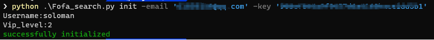
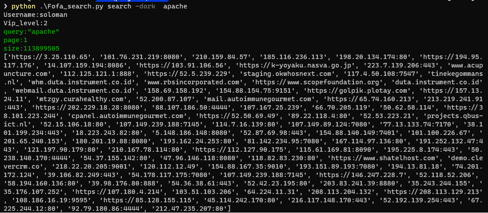
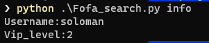

# fofaSearch

`fofapi` The command line call implementation version,Depend on 
https://fofa.so/static_pages/api_help

Convenient for target search and export. Inspiration and parts code From similar projects
https://github.com/knownsec/ZoomEye-python

```
❯ python .\Fofa_search.py -h
usage: Fofa_search.py [-h] {search,init,info} ...

positional arguments:
  {search,init,info}
    search            domain,host,ip,header,body,title and == = != =~
    init              Initialize for fofasearch
    info              Show identityInformation

optional arguments:
  -h, --help          show this help message and exit
```

#### init


#### search
```
❯ python .\Fofa_search.py search -h
usage: Fofa_search.py search [-h] [-dork DORK] [-page PAGE] [-size SIZE] [-fields FIELDS] [-full FULL] [-f FILE]

optional arguments:
  -h, --help            show this help message and exit
  -dork DORK            searchRules
  -page PAGE            The number of pages to turn, the default is the first page
  -size SIZE            The number of records returned per query, the default is 100, and the maximum can be set to
                        10000. Note: The body field contains more content, and it is recommended to get ≤100 records
                        each time
  -fields FIELDS        Optional parameter field list, the default is host, separate multiple parameters with commas,
                        such as (fields=ip,title)
  -full FULL            The default is false, the default is the same as the page search, only the data within one
                        year can be searched, and the specified as true is searched for all data
  -f FILE, --file FILE  save result in file
  ```

#### info

